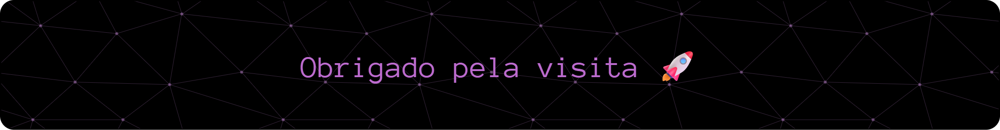

---

<picture>
  <source media="(prefers-color-scheme: dark)" srcset="https://readme-typing-svg.herokuapp.com?font=Fira+Code&pause=0.8&color=ECB1F7&width=435&size=19&lines=%F0%9F%9B%A0+Tecnologias+e+Ferramentas%3A">
  <source media="(prefers-color-scheme: light)" srcset="https://readme-typing-svg.herokuapp.com?font=Fira+Code&pause=0.8&color=B359BD&width=435&size=19&lines=%F0%9F%9B%A0+Tecnologias+e+Ferramentas%3A">
  
</picture>

<h4>
  🌐 Front-end
</h4>

    

<h4>
  🗄️ Banco de Dados
</h4>

   

<h4> 🔧 Ferramentas</h4>

---
<table border="0" align="center" width="100%">
  <tr>
    <td align="center" width="50%" valign="bottom">
      <picture>
        <source media="(prefers-color-scheme: dark)" srcset="https://readme-typing-svg.demolab.com?font=Fira+Code&weight=300&size=17&pause=0.8&color=ECB1F7&center=true&vCenter=true&width=350&lines=%E2%9A%A1+Meu+Fluxo+de+Commits">
        <source media="(prefers-color-scheme: light)" srcset="https://readme-typing-svg.demolab.com?font=Fira+Code&weight=300&size=17&pause=0.8&color=B359BD&center=true&vCenter=true&width=350&lines=%E2%9A%A1+Meu+Fluxo+de+Commits">
        
      </picture>
       
      <picture>
        <source media="(prefers-color-scheme: dark)" srcset="https://github-readme-activity-graph.vercel.app/graph?username=JoaoPassis06&hide_title=true&bg_color=0D1117&point=FFFFFF&days=20&area=true&area_color=70E6D8&line=70E6D8&hide_border=true&color=C9D1D9">
        <source media="(prefers-color-scheme: light)" srcset="https://github-readme-activity-graph.vercel.app/graph?username=JoaoPassis06&hide_title=true&bg_color=ffffff&point=0D1117&days=20&area=true&area_color=008B8B&line=008B8B&hide_border=true&color=333333">
        
      </picture>
      
    </td>

  <td align="center" width="50%" valign="bottom">
      <picture>
        <source media="(prefers-color-scheme: dark)" srcset="https://readme-typing-svg.demolab.com?font=Fira+Code&weight=300&size=17&pause=0.8&color=ECB1F7&center=true&vCenter=true&width=350&lines=%F0%9F%92%BB+Linguagens+e+Tecnologias">
        <source media="(prefers-color-scheme: light)" srcset="https://readme-typing-svg.demolab.com?font=Fira+Code&weight=300&size=17&pause=0.8&color=B359BD&center=true&vCenter=true&width=350&lines=%F0%9F%92%BB+Linguagens+e+Tecnologias">
        
      </picture>
       
      <picture>
        <source media="(prefers-color-scheme: dark)" srcset="https://github-readme-stats.vercel.app/api/top-langs/?username=JoaoPassis06&langs_count=6&layout=compact&bg_color=0D1117&title_color=70E6D8&text_color=C9D1D9&color_weight=70E6D8&hide_border=true&hide_title=true">
        <source media="(prefers-color-scheme: light)" srcset="https://github-readme-stats.vercel.app/api/top-langs/?username=JoaoPassis06&langs_count=6&layout=compact&bg_color=ffffff&title_color=008B8B&text_color=333333&color_weight=008B8B&hide_border=true&hide_title=true">
        
      </picture>
    </td>
  </tr>
</table>

### 📫 Como me encontrar:

        
  
  ---

